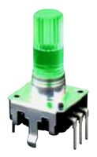
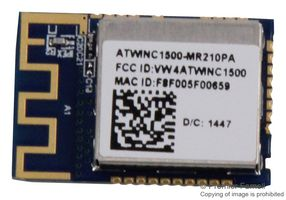
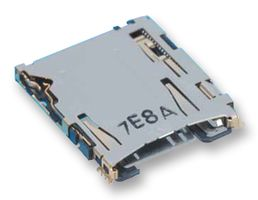
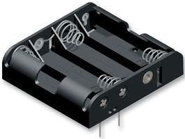

# Pop Button

## Introduction
Do you know Sonia?

Sonia is a young mum, her little baby is sick and she needs to buy some medication.
So she, as everyone in 19th century, grabs a piece of paper and notes down the medicine along other things as the eggs she needs for Patrick's birthday's cake...

The day after, in the grocery she realize that she left the list on the fridge and forgot about the medication, once she came back at home the baby was dying and the neighbour had called the police... She is now serving 5 years at Guantanamo for medical negligence.

>Did you ever experienced something similar ???  
>Do you want to go in Guantanamo ???

## Don't worry we have the solution : The Pop Button !

The Pop Button is a little device that fits in your cosy place and allows you to keep track of whatever item you need on the cloud in order to manage it the more efficient way.

If Sonia would have had a POP Button, once she realize she forgot the list on the fridge, she would be able to connect with here portable to our server and find back all the items she entered thanks to here POP friend.

## So what do we need ?

### _A PIC_
>
>
>The choice of the PIC have been done mostly on the power consuption performance and the availability on farnell as well as the number of SPI ports.

### _A Button_
>
>
>We choose this encoder because it feets exactly our needs: it rotate infinitly either ways, it has a push button integrated enabling the ability to choose and select within an instant, further to that it also has an RGB led incorporated !

### _A Wifi Module_
>
>
>In order to communicate with the server we needed a wifi connection that we found in the atwinc1500, this module is compatible for most wifi encryption and has an SPI interface as well as a low-power mode.

### _A screen_

>
>
>We choose this screen because it is large enough to contain a good list of word,it has a english and Japanese font set, it is bright so we can see it in different environnements and it is 3.3V powered wich make it easy to interface with all other modules.

>#### _Screen Connector_
>>
>>

### _Memory Socket_
>
>
>If you are a compusilve buyer you will need a lot of product in your list, that's why we choose to add a memory extension.

### _Photo-Diode_
>
>
>Thanks to the half-god Gregory Le Grand we will use a photo-diode to interact with the device, we choose this one because it can detect a distance of 7.4cm

### _Piezo_
>
>
>Because everyone love music, we necessarily wanted a good audio interface that satisfy this requirement.

### _Switch_
>
>
>This basic switch will be the one to turn all the lights off, in order to store the product we want a way to switch it completly off keeping the batteries inside

### _Battery Holder
>
>Because it wont hold itself, we choose this one because it widely used, well appreciated and we needed enough mAh to be able to use the device during several months
>> we have 4 AA batteries holding each one 2850mAh
>>>4 * 2850 = 11400
>>
>>Our device consume at most 500mA in case everything work at the same time  
>>>so 11400/500 = 22.8 hours the hard way  
>>
>>considering using the device 15 minutes a day we use it 7h45 by month
>>
>>> 22 / 7.75 = 2,84 months
>>
>>In this conditions we can use the device during ~three months without changing the batteries witch is acceptable.

