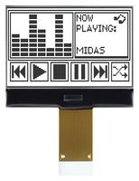

# Pop Button

## Introduction
Do you know Sonia? Sonia is a young mum, her little baby is sick and she needs to buy some medication for him. So she, as everyone, grabs a piece of paper and notes down the medicine along other things as the eggs she needs for the baby's birthday's cake... The day after, in the grocery she realize that she left the list on the fridge and forgot about the medication, once she came back at home the baby was dying and the neighbour had called the police... She is now serving 5 years at Guantanamo for medical negligence.

Did you ever experienced something similar ???
Do you want to go in Guantanamo ???

Here is the solution : The Pop Button !

The Pop Button is a little device that fits in your cosy place and allows you to keep track of whatever item you need on the cloud in order to manage it the more efficient way.

here goes some Pictures of what we need

